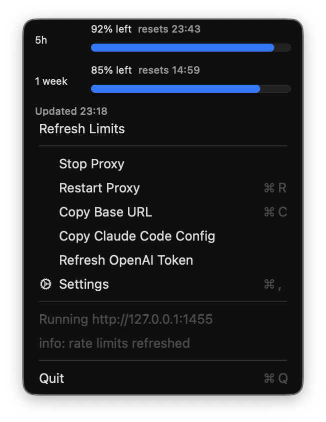

# CodexAPI



Native macOS tray app for a local Codex reverse proxy.

The proxy exposes OpenAI-compatible local endpoints and forwards requests to the
Codex upstream used by the Codex CLI:

- `GET /v1/models`
- `POST /v1/responses`
- `POST /v1/responses/compact`
- `POST /v1/chat/completions`
- `POST /v1/completions`

It also exposes Anthropic-compatible endpoints at the root base URL for Claude
Code:

- `GET /v1/models`
- `POST /v1/messages`
- `POST /v1/messages/count_tokens`
- `GET /health`

The implementation is Swift/AppKit for the tray UI and Swift/Foundation plus
Network.framework for the local HTTP proxy. `CLIProxyAPI/` is kept only as a
local reference and is ignored by git.

## Run

```bash
just run
```

Open the tray menu and choose `Login OpenAI` to run the Codex OAuth flow in
the browser. The app receives the callback at `/auth/callback`, stores the
access/refresh token in its local settings, and refreshes OAuth tokens before
expiry.

You can also choose `Settings` and set an upstream Codex access token manually.
By default the proxy listens on:

```text
http://127.0.0.1:1455/v1
```

Use that `/v1` URL as the OpenAI-compatible base URL. Claude Code uses the root
base URL instead:

```text
http://127.0.0.1:1455
```

If `Token` is empty, the proxy falls back to the incoming
`Authorization: Bearer <token>` header. If `Proxy Key` is set, requests must use
that key locally and a separate upstream `Token` must be configured.

The OAuth flow follows the Codex CLI-style PKCE flow used by `CLIProxyAPI`:

- authorization endpoint: `https://auth.openai.com/oauth/authorize`
- token endpoint: `https://auth.openai.com/oauth/token`
- redirect: `http://localhost:1455/auth/callback` by default
- scope: `openid email profile offline_access`

`GET /v1/models` uses the local Codex model catalog. Anthropic clients are
detected from Anthropic headers or Claude Code user agents and receive the
Anthropic models shape; other clients receive the OpenAI models shape. If the
stored settings still contain the old default models, the app treats them as
automatic and exposes the current catalog instead. When the OAuth `id_token`
includes a ChatGPT plan type, the automatic catalog follows that plan.

The tray menu also includes `Copy Claude Code Config`, which copies shell
environment variables for launching Claude Code against the root local proxy URL.
Claude Code uses the Anthropic Messages API; the proxy translates `/v1/messages`
into the Codex upstream `/responses` protocol and translates Codex responses
back to Anthropic message events.

## Build an app bundle

```bash
just app
open CodexAPI.app
```

The generated app bundle is a menu-bar-only app (`LSUIElement=true`) and is not
tracked by git.

## Build and package

`just` is the project build entrypoint:

```bash
just test       # run tests
just release    # build the release binary
just app        # build CodexAPI.app
just open-app   # build and open CodexAPI.app
just package    # create dist/CodexAPI-1.0.1-macos.zip
just clean      # remove generated artifacts
```
